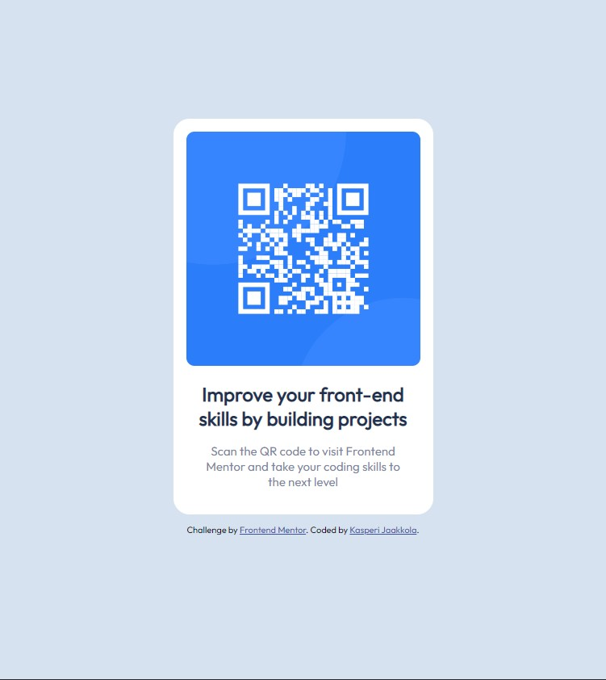

# Frontend Mentor - QR code component solution

This is a solution to the [QR code component challenge on Frontend Mentor](https://www.frontendmentor.io/challenges/qr-code-component-iux_sIO_H). Frontend Mentor challenges help you improve your coding skills by building realistic projects. 

## Table of contents

- [Overview](#overview)
  - [Screenshot](#screenshot)
  - [Links](#links)
- [My process](#my-process)
  - [Built with](#built-with)
  - [What I learned](#what-i-learned)
  - [Continued development](#continued-development)
  - [Useful resources](#useful-resources)
- [Author](#author)

## Overview

Today I decided to start training my front-end development skills with Frontend Mentor. I started this QR code component challenge since it was recommended for starting out. I went into this thinking it would be easy, but I did have a few challenges on the way.

### Screenshot



### Links

- Solution URL: [Add solution URL here](https://your-solution-url.com)
- Live Site URL: [Add live site URL here](https://your-live-site-url.com)

## My process

I scoped out my materials and then started by making my HTML code. I'm alrady pretty comfortable with writing html, so I didn't have many problems with this section. I did have to research Google fonts a little bit, though. Then I dived into CSS first by addressing the fonts and colors stated in the style guide. After this I started building the card with flex display, but ran into a few problems and decided the block display would suit this project better. I then finished the box with its contents inside and struggled a little while to get the box centered on the screen. I solved this problem by using the margin: auto. I should've had realised this solution quicker. Finally, I put my version with the design side by side and tried to match the details as well as I could.

### Built with

- Semantic HTML5 markup
- CSS custom properties
- Mobile-first workflow

### What I learned

I learned to adjust the position of the contents without flexbox, how to make a simple box for content and how to use custom Google fonts. I also learned that even simple things can take a lot more time than anticipated, even if they might seem straight-forward at first.

```css
.card {
  padding: 16px;
  border-radius: 20px;
  text-align: center;
  width: 290px;
  margin: auto;
}
```

### Continued development

In my future projects I will be utilizing what I learned to make different kinds of boxes of content.

### Useful resources

- [11 Ways to Center Div or Text in Div in CSS - Jamie Juviler](https://blog.hubspot.com/website/center-div-css) - This helped me understand how to center content using the margin: auto; method.
- [CSS Layout - Horizontal & Vertical Align - W3Schools](https://www.w3schools.com/css/css_align.asp) - This also helped me with aligning content properly.
- [Get Started with the Google Fonts API - Google Fonts](https://developers.google.com/fonts/docs/getting_started) - This article teached me how to use custom Google Fonts in my projects. This is something I'll be using in many future projects.

## Author

- GitHub - [qkas](https://github.com/qkas/)
- Frontend Mentor - [@qkas](https://www.frontendmentor.io/profile/qkas)